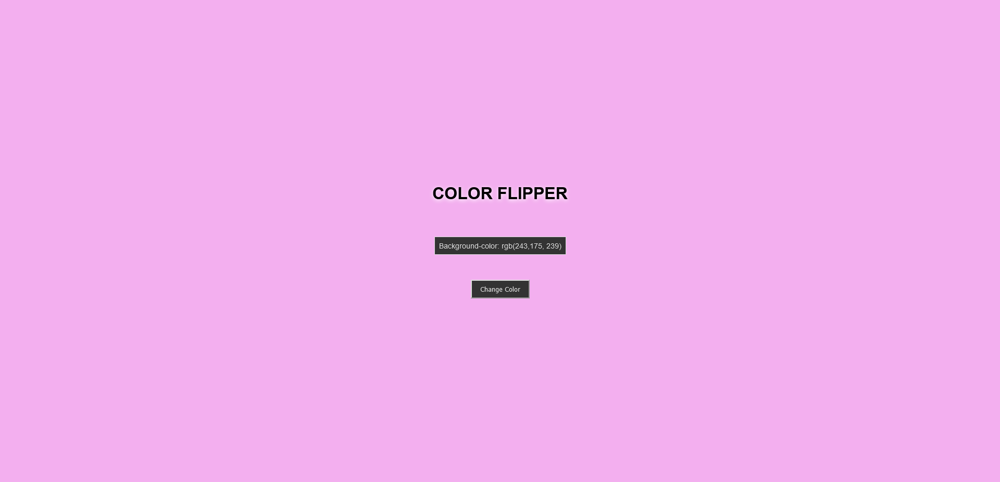

# Color Flipper

## Table of contents

- [Overview](#overview)
  - [The challenge](#the-challenge)
  - [Screenshot](#screenshot)
  - [Links](#links)
- [My process](#my-process)
  - [Built with](#built-with)
  - [Key concepts covered](#key-concepts-covered)

## Overview

### The challenge

Users should be able to:

- Change the body background color to random rgb color and see what is the rgb color value

### Screenshot

### Links

- Solution URL: [Code on github](https://github.com/waldekglaz/Background-Color_Flipper)
- Live Site URL: [Live](https://waldekglaz.github.io/Background-Color_Flipper/)

## My process

### Built with

- Semantic HTML5 markup
- CSS custom properties
- Flexbox
- Vanilla javaScript
- Mobile-first workflow

### Key concepts covered

- document.querySelector()
- addEventListener()
- document.body.style.backgroundColor
- Math.floor
- Math.random
